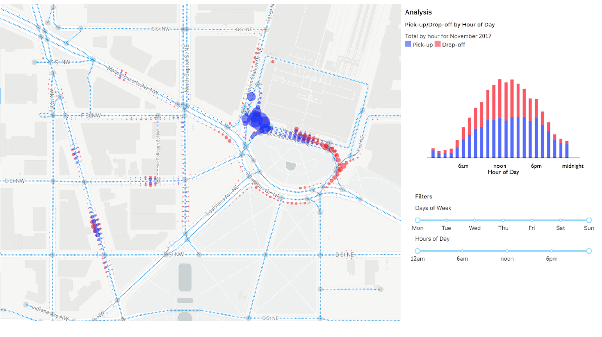

# SharedStreets UI Curb Demo 



Install steps:

```
git clone git@github.com:sharedstreets/sharedstreets-explorer.git

cd sharedstreets-explorer

git checkout curb_demo

# initial setup/start 

npm install 

npm start 

# open http://localhost:3000/38.90405/-77.0304/16.494/ 

# adding curb data tiles

mkdir -p src/public/data/tiles/curb/

cp [path to curb tile files] src/public/data/tiles/curb/

# edit src/config.ts
# change  export const EVENT_FILE_TYPE = 'curb';  to export const EVENT_FILE_TYPE = '{name of file type e.g. events}';
# export const EVENT_FILE_TYPE = 'events';
#
# change PICKUP_EVENT_LABEL and DROPOFF_EVENT_LABEL to match event label used input data


```
